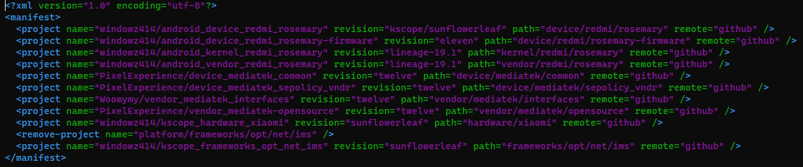

<!-- _backgroundColor: aquq -->

<!-- paginate: false -->

## Introduction to AOSP

### Week-2 (Preparing to Build and Building AOSP)

#### Installing Required Packages, Getting the Source and Building

Download [DOC](week-2.en.md_doc.pdf), [SLIDE](week-2.en.md_slide.pdf), [PPTX](week-2.en.md_slide.pptx)

<iframe width=700, height=500 frameBorder=0 src="../week-2.en.md_slide.html"></iframe>

---

<!-- paginate: true -->

### Outline

- Gathering maximum set of packages and configuration required for a proper AOSP build
- Installing binaries that aren't usually present on distro repositories
- Basics of `repo` tool
- Gathering a custom ROM (LineageOS) source and building it for your device

---

### Preparing to Build

Of course before we can build this piece of wonderful software named AOSP, we need to first gather a huge set of packages we need to install. Many distributions have different guides about this on their documentations. However, Google supports Debian-based ones strictly. Also keep in mind that **ANY KINDS OF SUBSYSTEMS LIKE WSL WILL _NOT_ WORK!** You will **STRICTLY** need a buffed VM with Linux on it or a Linux installation on your own PC as AOSP notes - "You must use Linux; building under either MacOS or Windows isn't supported". Cloud VMs also work but might make things like file transfer hard depending on your Internet connection and availability.

---

Now, let's come to package installations.

Simply put, this command will install all the tools you might need on various distributions of Android singlehandedly (except the `repo` tool, we'll install this discretely). Most of these are already present on Android source documentation.

```bash
sudo apt-get install git-core gnupg flex bison build-essential zip curl zlib1g-dev gcc-multilib g++-multilib libc6-dev-i386 libncurses5 lib32ncurses5-dev x11proto-core-dev libx11-dev lib32z1-dev libgl1-mesa-dev libxml2-utils xsltproc unzip fontconfig xmlstarlet python3 python-is-python3
```

---

### `repo` Tool

`repo` is a CLI tool developed by Google in Python to provide an easy way to clone all repositories to build something from source. It works in manifest basis and has 2 different manifest handlers: "Upstream manifest" and "Local manifest"

---

Upstream manifest is an entire Git repo including the default manifest as well as all other linked manifests needed to clone all repositories needed for a distribution to be built. The common tree convention is that there's a README providing little oversight on how to gather the sources (and sometimes how to build it too), a `default.xml` file that has core repositories from upstream AOSP and `<include />` tags to include more manifests in the same repository, a `snippets` folder that includes additional manifests that do the modifications over the AOSP manifest by `<remove-project />` and other tags processed by `repo` tool, and sometimes `assets` folder that includes all other assets for the README. You initialize your local directory with it.

---

Local manifest on contrary is a single manifest-ie that has additional and/or device-specific repository modifications that aren't usually provided by upstream manifest. You place these into `.repo/local_manifests` in your local directory after initializing upstream manifest. Pretty much same tags and parameters are processed by `repo` tool and appended into the generated manifest that can be viewed by `repo manifest`.

---

### Installing `repo`

Since this piece of tool doesn't exist on all Linux distros or otherwise usually outdated, Google provides us a generic piece of commands to install it manually. These usually tear down into this little script;

```bash
export REPO=$(mktemp /tmp/repo.XXXXXXXXX)
curl -o ${REPO} https://storage.googleapis.com/git-repo-downloads/repo
gpg --recv-key 8BB9AD793E8E6153AF0F9A4416530D5E920F5C65
curl -s https://storage.googleapis.com/git-repo-downloads/repo.asc | gpg --verify - ${REPO} && sudo install -m 755 ${REPO} /bin/repo
```

This first downloads the binary from Google API server, verifies it by checking against Google's key and then globally installs it.

---

### Initializing repository

`repo init` is the one we need for this part. The parameters we must pass are `-u <url>` and `-b <branch or tag>`. To get these informations, pretty much all ROMs have a repository that has one of these names which you should check around: `android`, `android_manifest`, `manifest`, `platform_manifest`

There are also some parameters that will disable some checks or otherwise minimize the source size by trimming out branches, Git history and such. The command I personally use when initializing a repository is like this;

```bash
repo init -u https://github.com/LineageOS/android -b lineage-19.1 --depth=1 --no-tags --no-clone-bundle --current-branch --config-name
```

---

This initializes repositories for an Android distribution named LineageOS, which is what we use when we need an Android distribution that doesn't ship Google apps and is easy to maintain unofficially. The extra parameters can be torn down to this;

- Initializes `lineage-19.1` branch.

- Clones only single revision of all repositories - Shallow repository, no history is generated.

- Doesn't clone tags. This is useful when you have nothing to do with tags opened on repositories.

- Doesn't use clone bundles, kind of saves storage space.

- Clones only the branch specified in the manifest instead of all branches.

- Allows user to configure their name and email when initializing repo instead of using the one in global Git configuration.

---

Once the repository is initialized, we'll also need to clone repositories that are made for your own device. These repositories are usually just `device/brand/codename`, `kernel/brand/chipset` and `vendor/brand`. For example, I'll be building this for Redmi Note 10S, which has the codename of `rosemary`. If you want to learn yours, you can search over GitHub with your device brand and model.

---



---

### Getting All Repositories for Building

Now that we're set up, all we need to do is a single command to sync everything up, which might take too long depending on your Internet connection speed;

```bash
repo sync -c --no-clone-bundle --no-tags --optimized-fetch --prune --force-sync -j$(nproc --all)
```

This command can be torn down to this;

- Clones only current branch.

- Doesn't use clone bundles.

- Doesn't clone tags.

- Optimizes fetching by using different methods.

- Prunes the repositories that have been removed after changing something in manifest.

- Forcefully syncs. This means that if remote for a repository has been changed in manifest, it first removes the old repository and clones the new one.

- Uses number of threads reported by the distribution to be available for syncing process. If you replace `$(nproc --all)` with a fixed number like 4, it will use that amount of threads instead.

---

### Build Process

Android build system uses multiple build processes at single command at once. Simply put, it uses these languages in its build system alone;

- Make

- Java

- Go

- Bazel

- Blueprint

- Rust

- Pesto

- Python

During the build, other functions and tools like GCC might be invoked when necessary as well.

---

Before starting to build, we need to ensure our device sources are adapted to Lineage's ones. This piece of command batch will do it all for you, presuming you've used the previously given manifest.

```bash
cd device/redmi/rosemary
rename 's/kscope/lineage/' kscope*
sed -i 's/kscope/lineage/' AndroidProducts.mk lineage_*
```

You might also need to do some manual edits like overlay adaptations and vendor configuration file path, which won't be covered here.

---

### Setting Up Current Session for Building Process

Google gives us a nice script inside `build` folder named `envsetup.sh`. This defines and some checks prior any kinds of build process. Trying to invoke `make` without first sourcing will give you an output like this and abort;

```
build/make/core/main.mk:2: Calling make directly is no longer supported.
build/make/core/main.mk:3: Either use 'envsetup.sh; m' or 'build/soong/soong_ui.bash --make-mode'
build/make/core/main.mk:4: *** done.  Stop.
```

This is because Make takes advantage of functions defined by EnvSetup and behaves accordingly. So let's source it first for preparing our current shell session;

```bash
source build/envsetup.sh
```

---

### Use of `lunch`

`lunch` is a function to simply set up variables defined by your device sources and platform right away. It can be invoked simply by giving it as a command, it will then give you a list of "product combos" that you can choose from.

---

```
$ lunch

You're building on Linux

Lunch menu... pick a combo:
     1. aosp_arm-eng
     2. aosp_arm64-eng
     3. aosp_car_arm-userdebug
     4. aosp_car_arm64-userdebug
     5. aosp_car_x86-userdebug
     6. aosp_car_x86_64-userdebug
     7. aosp_cf_arm64_auto-userdebug
     8. aosp_cf_arm64_phone-userdebug
     9. aosp_cf_x86_64_foldable-userdebug
     10. aosp_cf_x86_64_pc-userdebug
     11. aosp_cf_x86_64_phone-userdebug
     12. aosp_cf_x86_64_tv-userdebug
     13. aosp_cf_x86_auto-userdebug
     14. aosp_cf_x86_phone-userdebug
     15. aosp_cf_x86_tv-userdebug
     16. aosp_x86-eng
     17. aosp_x86_64-eng
     18. arm_krait-eng
     19. arm_v7_v8-eng
     20. armv8-eng
     21. armv8_cortex_a55-eng
     22. armv8_kryo385-eng
     23. car_ui_portrait-userdebug
     24. car_x86_64-userdebug
     25. gsi_car_arm64-userdebug
     26. gsi_car_x86_64-userdebug
     27. lineage_rosemary-eng
     28. lineage_rosemary-user
     29. lineage_rosemary-userdebug
     30. qemu_trusty_arm64-userdebug
     31. sdk_car_arm-userdebug
     32. sdk_car_arm64-userdebug
     33. sdk_car_portrait_x86_64-userdebug
     34. sdk_car_x86-userdebug
     35. sdk_car_x86_64-userdebug
     36. silvermont-eng
     37. uml-userdebug

Which would you like? [aosp_arm-eng]
```

---

### Different Ways to Start Building

Unlike all other software, AOSP has different ways to trigger building, the most commonly used are `m` and `make`. However, LineageOS also provides additional functions like `mka` and `brunch`. These all do the same and invoke `$(gettop)/build/soong/soong_ui.bash --build-mode --all-modules --dir="$(pwd)"` command for build process. What `soong_ui.bash` does is that it first compiles `soong_ui` in Go, then invokes the compiled binary with the parameter given in the end, starting the actual build process. Keep in mind though, building AOSP is pretty heavy on system resources so you might want to leave your system aside until it finishes compiling. To start building as a "flashable ZIP", just invoke `m bacon` as direct `m` will instead build just images and leave the flashing work onto you - You'll need to flash all images by yourself if there's nothing to handle that automatically, which only Google Pixel devices usually do.

---

### References

- Required packages: [Establishing a Build Environment | Android Open Source Project](https://source.android.com/docs/setup/start/initializing)

- Installation of `repo` tool: [Source Control Tools - Repo | Android Open Source Project](https://source.android.com/docs/setup/download#repo)
